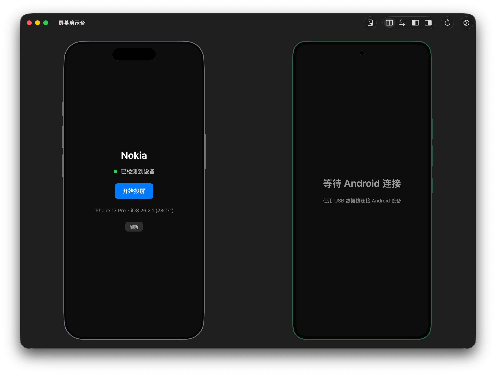
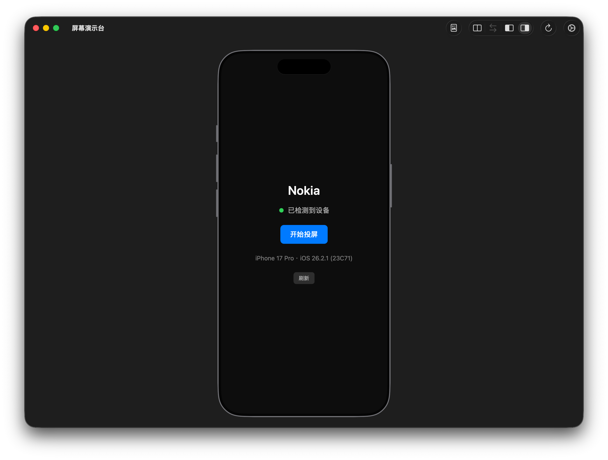
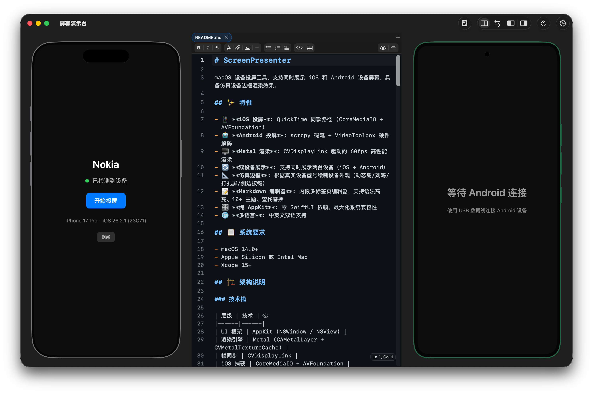
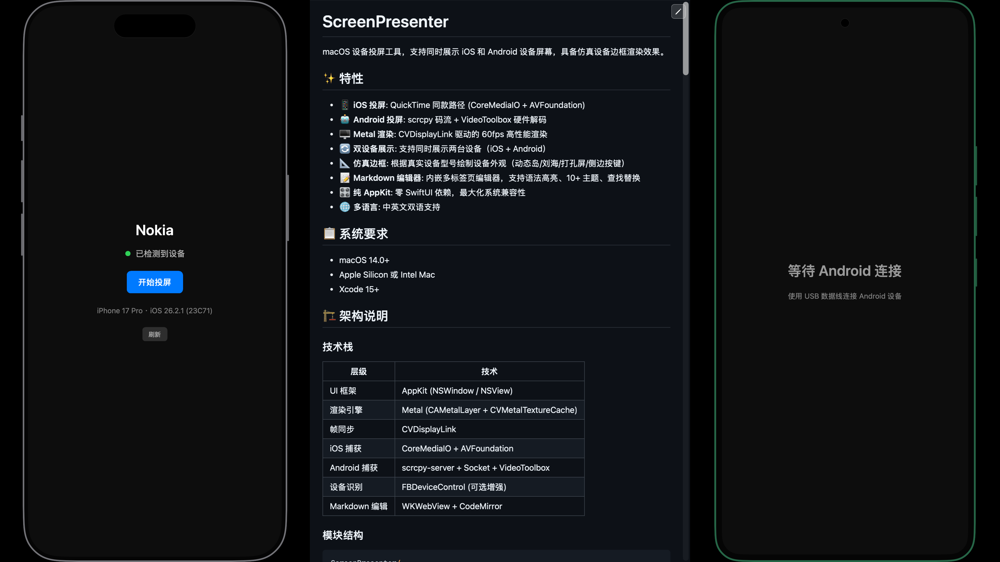
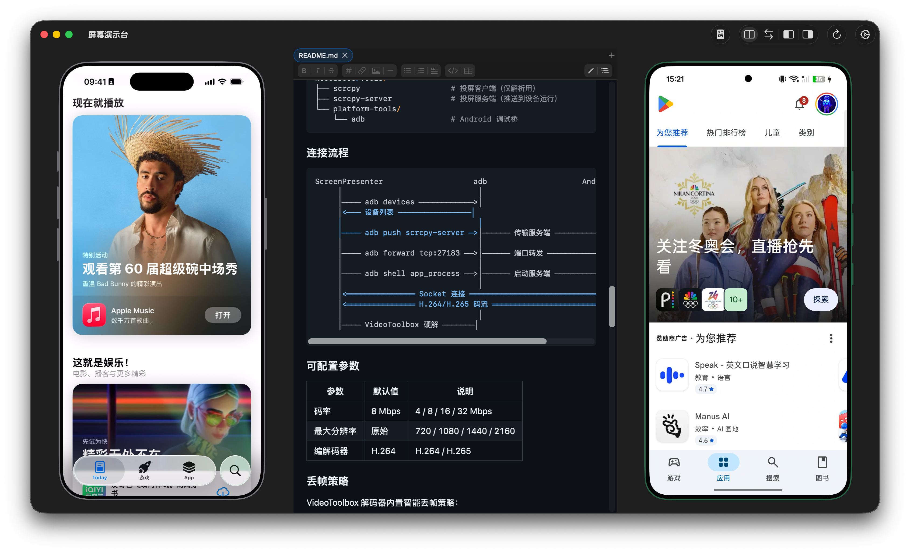
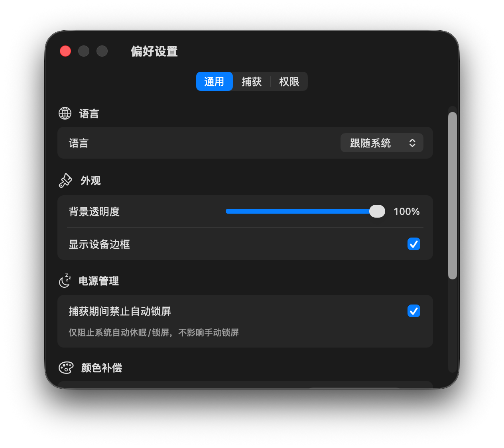
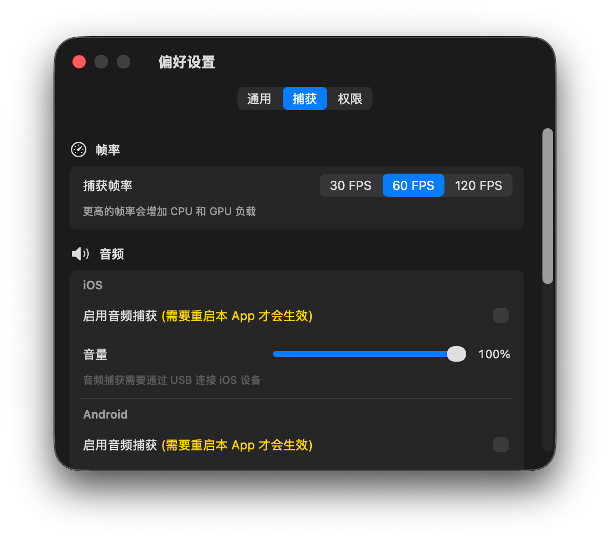
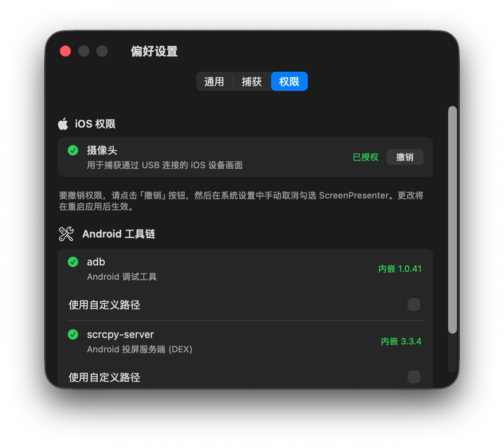

# ScreenPresenter

ScreenPresenter 是一款 macOS 原生设备投屏工具，支持同时展示 iOS 与 Android 设备屏幕，并提供高还原度的设备边框渲染与内嵌 Markdown 编辑器。

## 截图

| 双设备主界面 | 单设备主界面 |
|---|---|
|  |  |

| 分屏文档查看 | 分屏文档编辑 |
|---|---|
|  |  |

| 双设备投屏中 | 偏好设置-通用/捕获/权限 |
|---|---|
|  |  |

| 偏好设置-通用 | 偏好设置-捕获 |
|---|---|
|  |  |

## 核心特性

- iOS 投屏：CoreMediaIO + AVFoundation（QuickTime 同路径）
- Android 投屏：scrcpy 码流 + VideoToolbox 硬件解码
- Metal 渲染：CVDisplayLink 驱动高帧率渲染
- 双设备展示：同窗同时展示 iOS/Android，支持布局切换
- 设备边框：按设备型号渲染动态岛/刘海/打孔屏/侧键等特征
- Markdown 编辑器：多标签、语法高亮、主题切换、查找替换、预览模式
- 本地化：简体中文 / English

## 系统要求

- macOS 14.0+
- Xcode 15+（开发构建）
- Apple Silicon / Intel Mac

## 快速开始

### iOS

1. 使用 USB 连接 iOS 设备并在设备上点击“信任此电脑”。
2. 确保设备已解锁。
3. 首次启动时授予 ScreenPresenter 摄像头权限（用于系统投屏采集链路）。

### Android

1. 在开发者选项中开启“USB 调试”。
2. 使用 USB 连接设备，并在设备上确认调试授权。
3. App 内置 `adb` / `scrcpy-server`，默认无需额外安装工具链。

## 文档编辑器

文档编辑器位于主窗口内，适用于投屏过程中的旁路记录、脚本、演示稿编辑。

### 关键行为

- 打开文件时，若当前只有一个空白未改动标签页，会直接复用该标签页。
- 启动 App 时会自动恢复上次打开的文档（不存在文件会自动跳过）。
- 未保存状态会在标签上显示标记（新建未落盘与已落盘未保存都支持）。
- `⌘W` 关闭当前文档标签页（不再关闭 App）。

### 常用快捷键

| 功能 | 快捷键 |
|---|---|
| 显示/隐藏文档编辑器 | `⌘⇧M` |
| 编辑/预览模式切换 | `⌘⇧V` |
| 查找 | `⌘F` |
| 查找和替换 | `⌥⌘F` |
| 查找下一个/上一个 | `⌘G` / `⇧⌘G` |
| 用所选内容查找 | `⌘E` |
| 选择所有相同项 | `⌥⌘E` |
| 选择下个相同项 | `⌘D` |
| 跳到所选内容 | `⌘J` |

## 偏好设置说明

- 音频捕获默认关闭。
- 当音频捕获关闭时，设备面板隐藏全部音频相关 UI（包括音频开关与音量控件）。
- 音频捕获开关为“重启 App 后生效”。偏好设置中已提供黄色提示文案。

## 自动更新

项目使用 Sparkle 自动更新：

- 更新源：`https://raw.githubusercontent.com/HapticTide/ScreenPresenter/main/appcast.xml`
- 安装包来源：GitHub Releases（公开仓库）

## 构建

```bash
xcodebuild -project ScreenPresenter.xcodeproj -scheme ScreenPresenter -configuration Debug build
```

## 发布

推荐使用一键脚本：

```bash
# 交互式
./release_oneclick.sh

# 非交互
./release_oneclick.sh 1.1.0 --yes
```

发布脚本会串联处理：构建、签名、更新 appcast、创建 Release、回填下载地址。

Agent 发布流程说明见：`skills/screenpresenter-release/SKILL.md`

## 变更记录

- [docs/CHANGELOG.md](docs/CHANGELOG.md)

## 许可证

本项目采用 [MIT License](LICENSE)。
